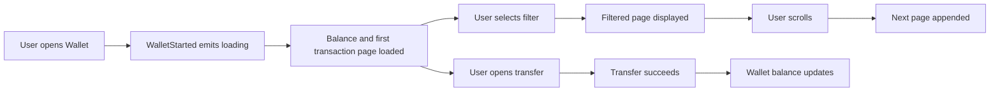

# ShopPlus Wallet Assessment

ShopPlus is a small Flutter wallet app for the Loynova senior Flutter assessment. It follows the same feature-first, BLoC-driven style used in the Hidaya reels feature: presentation widgets stay small, BLoCs own UI state, use cases sit between presentation and repositories, and data implementations stay behind domain contracts.

## Run

```bash
flutter pub get
flutter test
flutter analyze
flutter run -d chrome
```

The app supports Flutter Web and also runs on standard mobile targets.

## Architecture

The wallet feature is organized by feature and then by layer:

```text
lib/core/
  di/
  design_system/
  extensions/
  network/
    network_config.dart

lib/features/wallet/
  data/
    mappers/
    models/
    repositories/
  domain/
    entities/
    params/
    repositories/
    usecases/
  presentation/
    transfer/
    wallet/
  di/
```

The dependency direction is one-way:

```text
UI -> BLoC -> Use case -> WalletRepository -> Data implementation
```

`GetIt` registers the repository, use cases, and BLoCs explicitly in `wallet_injection.dart`. This keeps setup easy to inspect and mirrors the reels feature style without adding code generation.

## State Flow



`WalletBloc` keeps balance, transactions, selected filter, paging flags, and errors in a single immutable state. `TransferPointsBloc` owns form validation, submission status, known transfer errors, and one-shot success effects.

## Mock Repository

`MockWalletRepository` uses the exact assessment sample data for balance, merchants, and transactions. It also simulates:

- network delay for balance, transaction, and transfer calls;
- transaction filtering by type;
- simple page-based pagination;
- successful transfers that reduce the local balance and insert a transfer-out transaction;
- typed wallet errors for insufficient balance and recipient not found.

The mock is private to the data layer. The UI only receives domain entities.

## Error Handling

Repository failures are represented as `WalletException` values. BLoCs map those failures into presentation state, and widgets render retry views, field-level validation, snackbars, or success dialogs. The form validates recipient, points, and note before allowing submission.

## Sensitive Data

Transfer recipient and note values are kept only in form/BLoC state, are never logged, and are cleared after a successful submission. In a production API version, the same boundary would also avoid storing raw recipient data in analytics, crash logs, or debug traces.

## Responsive UI

The wallet screen uses one column on small screens and a two-column layout on wider web/tablet screens. Transaction rows are rendered lazily, and image fallbacks keep tests and offline runs stable.

## Theme And App Colors

The app defines two Material themes in `ShopPlusTheme`: `light()` and `dark()`. `ShopPlusMaterialApp` wires them through `theme`, `darkTheme`, and `themeMode`, while `ThemeCubit` stores the selected mode so the runtime light/dark switch stays consistent after restart.

Raw app colors are intentionally restricted. `_ShopPlusColors` is private and declared as a `part` of `shopplus_theme.dart`, so feature widgets cannot import and use brand colors directly. Screens should read colors from `Theme.of(context).colorScheme` first. When the design needs app-specific semantic colors that do not exist in Material `ColorScheme`, they are exposed through `ShopPlusColorScheme`, a `ThemeExtension` available as `Theme.of(context).shopPlusColorScheme`.

This keeps color usage centralized, makes light and dark theme behavior predictable, and avoids scattered raw hex values inside feature code.

## Localization

English and Arabic are supported through Slang. Typed strings live in `lib/i18n`, generated localization code lives in `strings.g.dart`, and the wallet title row includes a runtime language switch. The app still uses Flutter localization delegates and direction-aware layout APIs such as `EdgeInsetsDirectional` and `AlignmentDirectional`, so Arabic renders right-to-left without separate screens.

## Testing

The test suite covers:

- mock repository balance, transactions, filtering, pagination, and transfer behavior;
- wallet BLoC loading, filtering, paging, refresh, stale request handling, and transfer balance updates;
- transfer BLoC validation, submission, known errors, and effect clearing;
